# AI 今日上上签小程序详细计划图表文档

生成日期：2026-06-21

资料来源：`对话ai产生灵感.txt`

项目方向：面向急功近利、焦虑型、渴望即时反馈的人群，设计一个广告收入优先、轻量可快速上线的微信小程序。

---

## 1. 项目结论

### 1.1 一句话定位

AI 今日上上签不是算命工具，而是一个带有仪式感的每日心理指引小程序：用“抽卡、今日宜忌、情绪打卡、微行动”的形式，把用户对不确定性的焦虑转化为当天可执行的小行动。

### 1.2 为什么优先做它

根据灵感文件末尾的方案排序，在广告收入优先、不依赖版号的前提下，AI 今日上上签是第一优先级：

| 维度 | 判断 |
| --- | --- |
| 打开频率 | 每日指引天然适合每天打开 |
| 内容传播 | 指引卡、运势卡、宜忌卡适合分享到朋友圈、小红书、抖音 |
| 开发成本 | 核心是内容生成、情绪记录、分享图、广告组件，MVP 可控 |
| 广告变现 | 可接入 banner、激励视频、插屏，但需要控制频率 |
| 合规空间 | 不做预测命运，包装为娱乐性质和心理自助建议 |
| 冷门程度 | 纯玄学产品多，纯心理产品多，“AI 心理仪式感”轻量小程序相对少 |

### 1.3 产品核心策略

产品卖点不是“我知道你的未来”，而是“我帮你把今天过得更有方向”。

核心策略：

1. 用玄学式外壳吸引点击，用心理学和行动建议承接价值。
2. 用每日打卡形成高频留存，用分享卡形成自然裂变。
3. 用广告作为主要收入方式，先避免复杂付费体系。
4. 用内容模板和 AI 混合生成，降低成本并保证质量稳定。
5. 明确娱乐与自助属性，避免医疗、金融、命理承诺。

---

## 2. 用户与痛点

### 2.1 目标人群

| 人群 | 典型状态 | 核心需求 | 产品切入点 |
| --- | --- | --- | --- |
| 焦虑型年轻人 | 工作、学习、恋爱、财富压力大 | 想知道今天该怎么做 | 今日宜忌、今日小目标 |
| 急功近利型用户 | 付出后想快速看到反馈 | 想立刻获得被回应感 | 抽卡反馈、即时解释 |
| 轻玄学用户 | 喜欢星座、塔罗、答案之书 | 想要仪式感和趣味 | 指引卡、答案之书 |
| 自我提升用户 | 想改变但坚持困难 | 想要每天被轻推一下 | 微任务、连续打卡 |
| 内容分享用户 | 喜欢发朋友圈或小红书 | 想要好看的个性化内容 | 分享海报、关键词标签 |

### 2.2 核心痛点

| 痛点 | 表现 | 今日上上签的解决方式 |
| --- | --- | --- |
| 不确定性焦虑 | 不知道要不要行动、怎么行动 | 给出当天的方向和边界 |
| 即时反馈缺失 | 做一点事看不到回报就放弃 | 每次打开都有即时反馈 |
| 目标过大 | 想暴富、变优秀、脱单，但不知道今天做什么 | 拆成 3 分钟微行动 |
| 情绪无处安放 | 焦虑、空虚、内耗 | 情绪打卡和温和反馈 |
| 普通 AI 太泛 | 直接问 AI 得到的答案像大道理 | 用卡片、宜忌、行动模板包装 |

### 2.3 用户心理模型

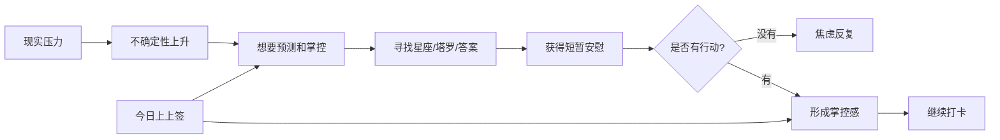

---

## 3. 产品定位与边界

### 3.1 产品名称建议

| 名称 | 气质 | 备注 |
| --- | --- | --- |
| 今日上上签 | 直接、清晰、适合工具型定位 | 推荐主名 |
| 今日灵感 | 更轻、更内容化 | 适合内容号 |
| 今日一签 | 玄学感强 | 可作为功能名 |
| 心象日历 | 更高级、更心理学 | 可作为后续品牌名 |
| 答案回声 | 文艺、有传播感 | 可作为“答案之书”模块名 |

建议：小程序名称用“今日上上签”，首页功能文案里使用“今日一签”“答案回声”等子模块名。

### 3.2 产品不做什么

| 不做 | 原因 |
| --- | --- |
| 不做八字、命盘、真人大师咨询 | 合规风险高，且内容成本高 |
| 不承诺预测未来 | 避免迷信宣传和用户误导 |
| 不做医疗心理诊断 | 避免医疗健康资质风险 |
| 不做重社交社区 | 审核、风控、运营成本过高 |
| 不做复杂会员体系 | MVP 阶段先验证广告模型和留存 |

### 3.3 合规表达原则

所有核心页面底部或设置页应包含：

> 本产品内容为娱乐和自我反思参考，不构成心理诊断、医疗建议、投资建议或人生决策依据。

内容生成时禁止：

1. 断言用户未来一定发生某事。
2. 鼓励用户进行高风险投资、借贷、辞职、分手等重大决策。
3. 暗示用户必须付费才能消灾、转运。
4. 输出自伤、自杀、极端情绪刺激内容。
5. 对未成年人输出恋爱、金钱、极端竞争诱导内容。

---

## 4. 核心功能规划

### 4.1 MVP 功能结构

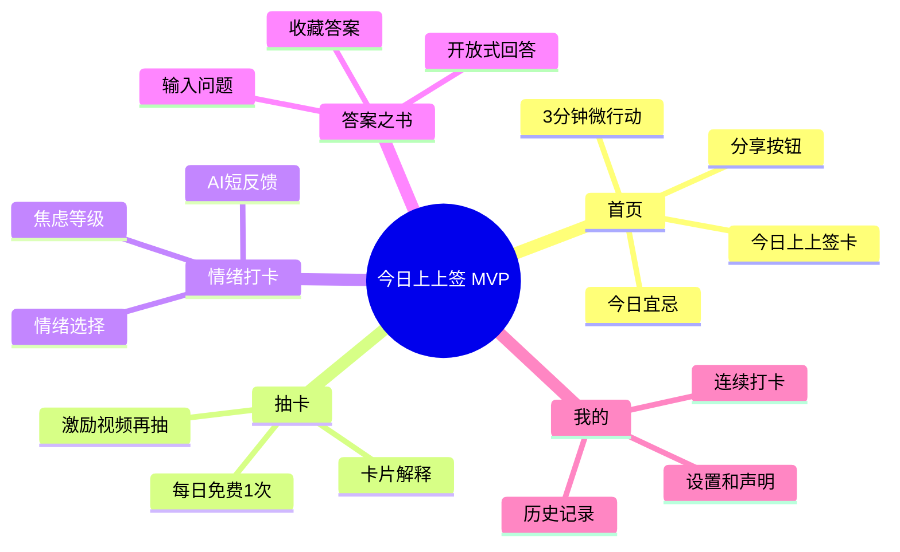

### 4.2 V1 功能清单

| 模块 | MVP 必做 | V1.1 可做 | V2 可做 |
| --- | --- | --- | --- |
| 今日上上签卡 | 每日生成一张卡 | 根据用户近 7 天情绪个性化 | 多主题卡组 |
| 今日宜忌 | 固定模板 + AI 改写 | 按用户目标分类 | 节气、星座、热点主题 |
| 微行动 | 每天 1 个 3 分钟任务 | 任务完成反馈 | 目标拆解进度条 |
| 情绪打卡 | 情绪、能量、压力三项 | 情绪趋势图 | 月度 AI 报告 |
| 答案之书 | 输入问题生成回答 | 收藏和分享 | 多卡组回答风格 |
| 分享海报 | 生成单张卡片图 | 多模板 | 用户自定义风格 |
| 广告 | banner + 激励视频 | 插屏 A/B 测试 | 广告策略自动优化 |
| 内容后台 | 简单模板表 | 审核流 | 运营活动配置 |

### 4.3 首页信息架构

首页第一屏必须直接给用户结果，不做介绍页。

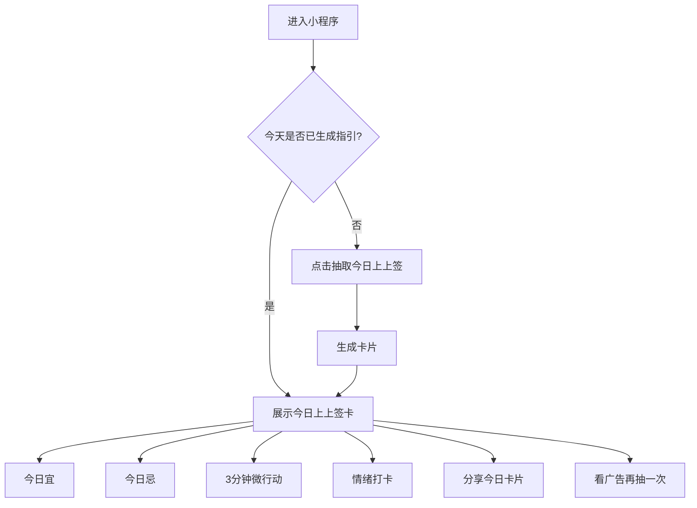

---

## 5. 用户流程设计

### 5.1 首次使用流程

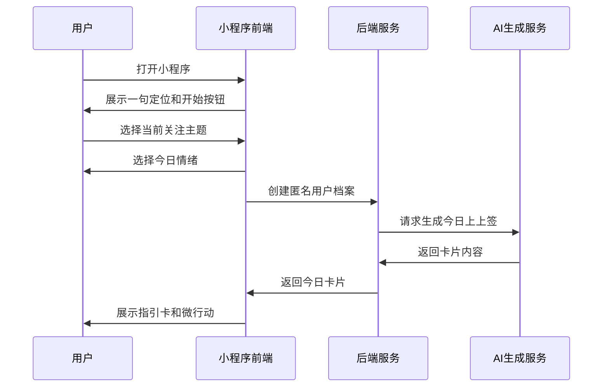

首次使用只问 2 个问题：

1. 你最近最在意什么：事业 / 学习 / 感情 / 金钱 / 自我状态 / 人际关系。
2. 你现在的状态更像：焦虑 / 疲惫 / 期待 / 迷茫 / 平静 / 兴奋。

不建议一开始要求手机号、微信授权头像昵称。匿名体验更轻，更适合冷启动。

### 5.2 每日回访流程

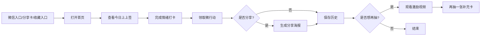

### 5.3 分享裂变流程

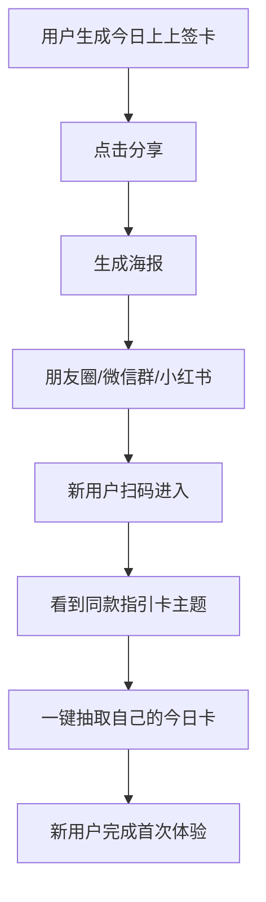

分享海报必须包含：

1. 卡片标题。
2. 今日关键词。
3. 一句适合传播的短句。
4. 小程序码。
5. 免责声明短句：“娱乐与自我反思参考”。

---

## 6. 页面设计规划

### 6.1 页面列表

| 页面 | 路径建议 | 目标 |
| --- | --- | --- |
| 首页 | `/pages/index/index` | 展示今日上上签和主要操作 |
| 抽卡页 | `/pages/draw/draw` | 提供仪式感抽卡动画 |
| 结果页 | `/pages/result/result` | 展示完整卡片和广告触发 |
| 情绪打卡页 | `/pages/mood/mood` | 记录情绪并给反馈 |
| 答案之书页 | `/pages/answer/answer` | 用户提问获取开放式回答 |
| 历史页 | `/pages/history/history` | 查看过去指引和情绪 |
| 分享海报页 | `/pages/share/share` | 生成分享图 |
| 我的页 | `/pages/profile/profile` | 设置、声明、反馈 |

### 6.2 首页首屏草图

```text
┌─────────────────────────────┐
│  今日上上签                    │
│  6月21日  周日               │
├─────────────────────────────┤
│      今日关键词：稳住        │
│                             │
│  你不需要立刻证明自己，      │
│  今天先完成一个能交付的小动作。│
│                             │
│  宜：把大目标拆成10分钟       │
│  忌：反复比较别人的进度       │
│                             │
│  3分钟行动：写下今天最小一步  │
├─────────────────────────────┤
│ [记录情绪] [生成分享卡]       │
│ [看视频再抽一张补充卡]        │
└─────────────────────────────┘
```

### 6.3 视觉风格

不建议做得过度玄学或过度心理咨询。推荐“轻神秘 + 清醒行动”的风格。

| 设计项 | 建议 |
| --- | --- |
| 主色 | 深墨色、暖金色、雾白色、少量珊瑚红 |
| 辅色 | 安静蓝绿、浅紫灰，用于情绪分类 |
| 字体 | 微信默认字体，标题加粗，正文留白 |
| 卡片 | 圆角不超过 8px，避免过度软萌 |
| 动效 | 抽卡翻转、光影轻扫、结果淡入 |
| 图片 | 卡片背景使用渐变纹理或抽象自然图，不用夸张神像、符咒 |

### 6.4 导航结构

建议使用底部 Tab：

1. 今日
2. 答案
3. 记录
4. 我的

MVP 也可以先不用 Tab，仅首页聚合全部入口，减少开发量。

---

## 7. 内容与 AI 生成方案

### 7.1 内容结构

每张今日上上签卡由固定字段组成：

| 字段 | 示例 | 说明 |
| --- | --- | --- |
| `theme` | 事业 / 学习 / 感情 / 金钱 / 状态 | 用户关注主题 |
| `card_name` | 稳住牌 | 有记忆点的卡名 |
| `keyword` | 稳住 | 适合分享 |
| `opening` | 今天不适合用力过猛 | 情绪承接 |
| `advice` | 先做一个可交付的小动作 | 核心建议 |
| `do` | 整理一个最小任务 | 今日宜 |
| `avoid` | 反复比较别人的速度 | 今日忌 |
| `micro_action` | 写下今天 10 分钟内能完成的事 | 行动 |
| `reflection` | 你真正想要的不是快，而是确定自己没停下 | 反思 |
| `share_text` | 今天的关键词是：稳住 | 分享文案 |
| `risk_level` | normal / sensitive | 内容风控 |

### 7.2 生成策略

MVP 不建议每次都实时调用大模型生成完整内容。更稳的方式是：

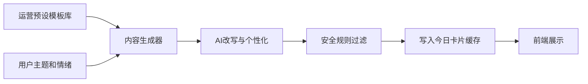

推荐策略：

1. 先准备 80-120 条高质量基础模板，覆盖 6 个主题和 6 种情绪。
2. 用户每日第一次进入时，后端按主题、情绪、历史记录选择模板。
3. AI 只做个性化改写和轻度扩写，降低成本。
4. 生成后缓存到当天，不重复消耗。
5. 对分享率高的卡片沉淀为人工精选模板。

### 7.3 AI 提示词模板

#### 今日上上签生成提示词

```text
你是一个温和、清醒、善于把焦虑转化为具体行动的每日指引助手。

请基于用户信息生成一张“今日上上签卡”。

用户关注主题：{{theme}}
用户当前情绪：{{mood}}
用户最近连续打卡天数：{{streak_days}}
最近一次卡片关键词：{{last_keyword}}

要求：
1. 不预测未来，不使用“必定、注定、一定会发财、一定会复合”等表达。
2. 不提供医疗、投资、法律建议。
3. 语气要有仪式感，但最终必须落到今天能做的小行动。
4. 今日宜和今日忌必须具体、轻量、可执行。
5. 微行动必须在 3-10 分钟内完成。
6. 输出 JSON，不要输出额外解释。

JSON 字段：
theme, card_name, keyword, opening, advice, do, avoid, micro_action, reflection, share_text, risk_level
```

#### 答案之书提示词

```text
你是“答案回声”，负责给用户一个开放式、非决定论的回答。

用户问题：{{question}}
用户当前情绪：{{mood}}

要求：
1. 不替用户做重大决定。
2. 不说“是/否”的绝对答案。
3. 用一句有记忆点的话开头。
4. 给出一个小观察和一个小行动。
5. 如果问题涉及自伤、医疗、投资、违法、极端情绪，返回安全提醒。

输出 JSON：
answer_title, answer_text, small_action, safety_note
```

### 7.4 内容风控规则

| 风险 | 处理 |
| --- | --- |
| 自伤、自杀 | 不生成指引，提示联系身边可信任的人或当地紧急服务 |
| 医疗诊断 | 明确不提供诊断，建议咨询专业医生 |
| 投资决策 | 不给买卖建议，只给风险提醒 |
| 恋爱操控 | 不鼓励控制、跟踪、骚扰 |
| 迷信承诺 | 禁止“改命、消灾、转运保证”等表达 |
| 未成年人敏感内容 | 降低恋爱、金钱诱导内容权重 |

---

## 8. 广告变现设计

### 8.1 广告优先级

| 广告形式 | MVP 是否接入 | 适合位置 | 风险 |
| --- | --- | --- | --- |
| Banner | 是 | 结果页底部、历史页底部 | 收益低但打扰小 |
| 激励视频 | 是 | 再抽一张、解锁深度解释 | 需要设计得自然 |
| 插屏广告 | 谨慎 | 用户完成一次完整流程后 | 打扰强，影响留存 |
| 原生广告 | V1.1 | 内容流或报告页 | 需要更精细 UI |

### 8.2 激励视频触发点

推荐触发：

1. 免费查看今日基础卡。
2. 看视频解锁“补充指引”。
3. 看视频生成“今日分享海报高清版”。
4. 看视频查看“本周情绪关键词”。

不推荐：

1. 首次进入就弹广告。
2. 基础结果还没看完就要求看广告。
3. 情绪低落用户连续触发广告。
4. 每次页面切换都插屏。

### 8.3 广告体验规则

| 规则 | 说明 |
| --- | --- |
| 首次使用 3 分钟内不出现插屏 | 先让用户感到产品有价值 |
| 每日激励视频最多 3 次 | 避免用户反感 |
| 情绪为“崩溃/极度焦虑”时不弹激励广告 | 保护体验和品牌 |
| 插屏只在完整流程结束后出现 | 不打断抽卡过程 |
| 广告位 A/B 测试 | 测试收益和留存的平衡 |

### 8.4 收入估算模型

```text
日广告收入 = DAU × 人均广告展示次数 × eCPM / 1000

示例：
DAU = 10,000
人均展示 = 2.5
eCPM = 20 元
日收入 = 10,000 × 2.5 × 20 / 1000 = 500 元
```

注意：eCPM、流量主开通条件、广告组件规则会变化，上线前必须以微信公众平台最新规则为准。

---

## 9. 技术实现方案

### 9.1 推荐技术路线

MVP 推荐使用微信原生小程序 + 云开发或轻量 Node.js 后端。

| 层级 | 推荐 |
| --- | --- |
| 前端 | 微信原生小程序 |
| UI | 原生组件 + 自定义卡片组件 |
| 后端 | 微信云开发 CloudBase 或 Node.js API |
| 数据库 | 云数据库 / MongoDB 风格集合 |
| AI 调用 | 后端统一调用，不在前端暴露 Key |
| 图片生成 | 小程序 Canvas 生成分享图 |
| 统计 | 自建埋点 + 微信小程序数据助手 |
| 广告 | 微信小程序广告组件 |

### 9.2 系统架构图

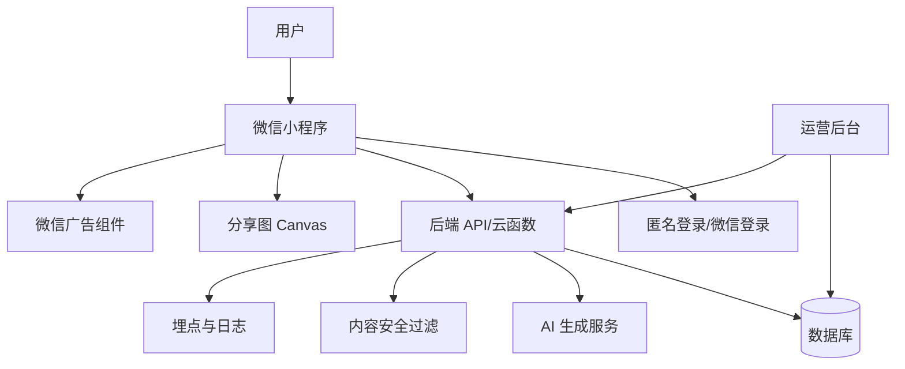

### 9.3 数据模型

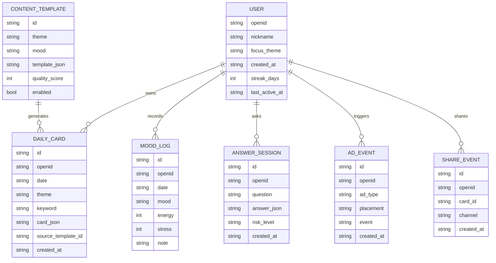

### 9.4 接口设计

| 接口 | 方法 | 作用 |
| --- | --- | --- |
| `/api/user/init` | POST | 初始化匿名用户 |
| `/api/card/today` | GET | 获取今日卡片 |
| `/api/card/generate` | POST | 生成今日卡片 |
| `/api/mood/log` | POST | 提交情绪打卡 |
| `/api/answer/ask` | POST | 答案之书提问 |
| `/api/history/cards` | GET | 获取历史卡片 |
| `/api/ad/event` | POST | 记录广告曝光和完成 |
| `/api/share/event` | POST | 记录分享行为 |
| `/api/feedback` | POST | 用户反馈 |

### 9.5 前端组件

| 组件 | 作用 |
| --- | --- |
| `GuideCard` | 展示今日上上签卡 |
| `MoodPicker` | 情绪选择器 |
| `ActionChip` | 今日宜忌和微行动标签 |
| `DrawDeck` | 抽卡动画 |
| `SharePoster` | 分享海报生成 |
| `AdUnlockButton` | 激励视频解锁按钮 |
| `SafetyNotice` | 免责声明 |
| `EmptyState` | 空状态 |

---

## 10. 开发路线图

### 10.1 从 2026-06-21 开始的 6 周 MVP 计划

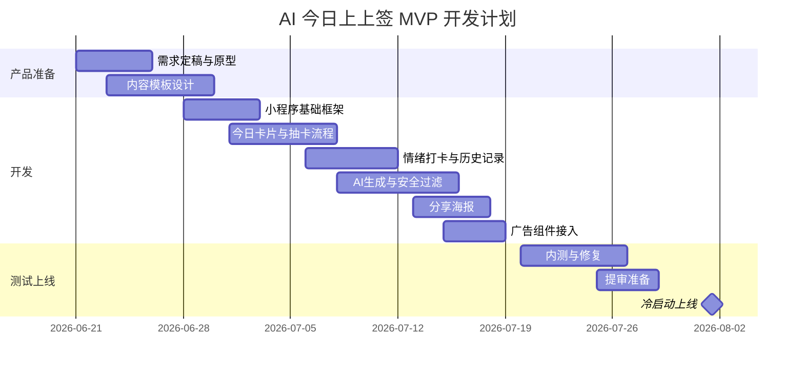

### 10.2 版本节奏

| 版本 | 时间 | 目标 | 核心交付 |
| --- | --- | --- | --- |
| MVP | 2026-08-01 前 | 跑通每日指引和广告路径 | 首页、抽卡、情绪、分享、广告 |
| V1.1 | 2026-09-01 前 | 适配开学季传播 | 学业/新开始主题卡组、分享模板 |
| V1.2 | 2026-10-01 前 | 提升留存 | 连续打卡、周报告、收藏 |
| V1.3 | 2026-12-01 前 | 年末流量冲刺 | 年度关键词、2027 指引专题 |
| V2.0 | 2027-01-01 前 | 新年爆发 | 新年签、年度报告、裂变活动 |

### 10.3 MVP 验收标准

| 类别 | 标准 |
| --- | --- |
| 功能 | 用户可完成首次抽卡、情绪打卡、分享海报、看广告再抽 |
| 性能 | 首页 2 秒内展示基础内容，AI 生成可异步加载 |
| 成本 | 同一用户每日主卡只生成一次并缓存 |
| 风控 | 敏感问题能触发安全提示 |
| 广告 | 激励视频完成后能正确发放再抽权益 |
| 数据 | 能记录 DAU、抽卡次数、打卡率、分享率、广告完成率 |

---

## 11. 运营与投放计划

### 11.1 关键时间窗口

当前日期为 2026-06-21。若现在启动，建议不要等到 2027 年新年才上线，而是按以下节奏：

| 时间 | 目标 | 运营重点 |
| --- | --- | --- |
| 2026-07 | 开发和内测 | 积累 80-120 条内容模板 |
| 2026-08 | 暑期冷启动 | 小红书、抖音测试内容方向 |
| 2026-09 | 开学季放量 | 学业焦虑、新开始、好运开局主题 |
| 2026-10 | 稳定留存 | 情绪打卡、连续记录、周报告 |
| 2026-11 | 年末预热 | 年度复盘、关系、事业选择主题 |
| 2026-12 | 年末冲刺 | 2027 年关键词、年度指引专题 |
| 2027-01 | 最大爆发 | 新年签、新年目标、新年仪式感 |

### 11.2 内容矩阵

| 平台 | 内容形式 | 目标 |
| --- | --- | --- |
| 小红书 | 指引卡截图、情绪共鸣文案 | 种草和收藏 |
| 抖音 | 每日抽卡短视频、评论区互动 | 泛流量曝光 |
| 微信群 | 分享卡、每日打卡 | 私域裂变 |
| 朋友圈 | 海报图 | 熟人传播 |
| 公众号 | 周度情绪主题文章 | 搜索和信任 |

### 11.3 小红书内容模板

标题方向：

1. 今天抽到的 AI 指引，像被点醒了一下。
2. 焦虑的时候别问运势，问今天能做哪一步。
3. 给急着成功的人，一张今日上上签卡。
4. 今天的关键词是稳住，别被别人节奏带走。
5. 我用 AI 给自己做了一个每日心理签。

正文结构：

```text
今天的关键词：{{keyword}}

最戳我的一句：
{{share_text}}

今日宜：{{do}}
今日忌：{{avoid}}

我准备做的 3 分钟小行动：
{{micro_action}}

不是算命，更像是每天把自己拉回现实的一张小卡。
```

### 11.4 冷启动目标

| 阶段 | 时间 | 目标 |
| --- | --- | --- |
| 种子测试 | 上线前 7 天 | 30-50 人真实体验 |
| 冷启动第 1 周 | 上线后 1-7 天 | 找到 1 个分享率最高的卡片模板 |
| 冷启动第 2 周 | 上线后 8-14 天 | 验证广告触发点不伤留存 |
| 第 1 个月 | 上线后 30 天 | 完成至少 3 次产品迭代 |
| 第 2 个月 | 2026-09 | 借开学季冲一波新增 |

### 11.5 日常运营节奏

| 频率 | 工作 |
| --- | --- |
| 每日 | 检查 AI 生成异常、广告异常、用户反馈 |
| 每日 | 发布 1-3 条短内容素材 |
| 每周 | 复盘分享率最高的 10 张卡 |
| 每周 | 新增或优化 10-20 条内容模板 |
| 每两周 | 调整广告位置和触发频率 |
| 每月 | 做一次主题活动，如开学、年末、520 |

---

## 12. 数据指标体系

### 12.1 北极星指标

建议北极星指标：

> 每周完成今日上上签并产生有效互动的用户数。

有效互动包括：

1. 完成情绪打卡。
2. 点击分享。
3. 完成微行动。
4. 看激励视频解锁补充卡。
5. 收藏卡片。

### 12.2 核心漏斗

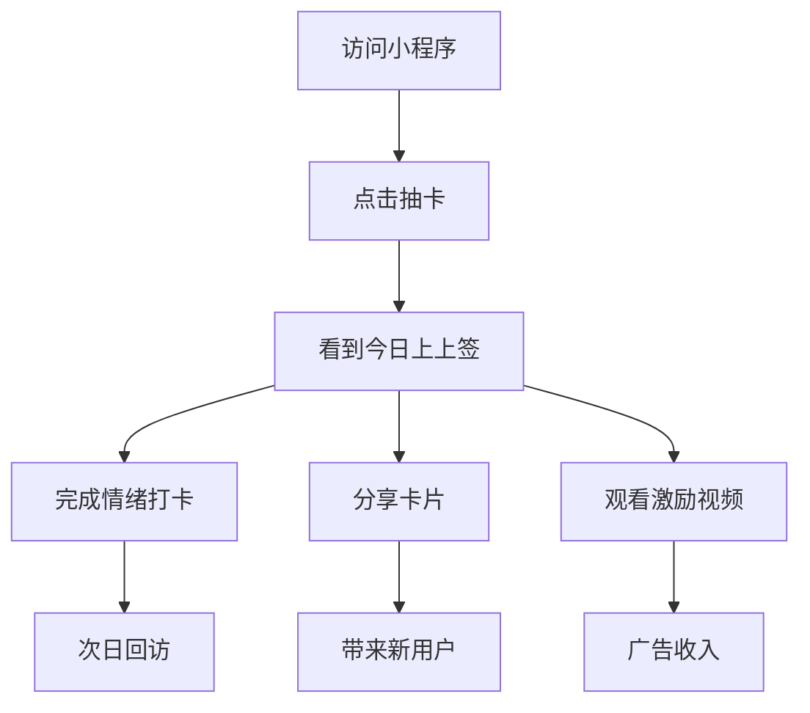

### 12.3 指标表

| 指标 | 含义 | 目标方向 |
| --- | --- | --- |
| DAU | 日活跃用户 | 判断流量规模 |
| 新用户抽卡率 | 新用户进入后抽卡比例 | 衡量首页吸引力 |
| 指引完成率 | 用户看到完整结果比例 | 衡量生成和展示体验 |
| 情绪打卡率 | 看卡后记录情绪比例 | 衡量用户投入度 |
| 分享率 | 看卡后分享比例 | 衡量裂变能力 |
| D1 留存 | 次日回访比例 | 衡量每日价值 |
| D7 留存 | 7 日回访比例 | 衡量习惯形成 |
| 激励视频完成率 | 触发后看完比例 | 衡量广告自然度 |
| 人均广告展示 | 每人每日广告次数 | 衡量变现强度 |
| 负反馈率 | 关闭、投诉、差评 | 衡量打扰程度 |

---

## 13. 成本与资源估算

### 13.1 人力配置

| 角色 | MVP 是否必需 | 工作 |
| --- | --- | --- |
| 产品/策划 | 必需 | 功能、流程、内容规则 |
| 小程序前端 | 必需 | 页面、组件、分享图、广告 |
| 后端/云函数 | 必需 | 数据、AI、缓存、风控 |
| UI 设计 | 可兼职 | 视觉、卡片模板 |
| 运营 | 必需 | 内容、渠道、反馈 |
| 测试 | 可兼职 | 功能和兼容性测试 |

极简配置：1 个全栈开发 + 1 个产品运营即可做 MVP。

### 13.2 成本项

| 成本 | 说明 | 控制方式 |
| --- | --- | --- |
| AI 调用 | 个性化生成消耗 | 模板 + 缓存，减少实时生成 |
| 云服务 | 数据库、云函数、CDN | 初期使用云开发免费或低档套餐 |
| 设计 | 卡片和分享图 | 先做 3-5 套模板 |
| 投放 | 小红书/抖音测试 | 小预算测试，不大规模烧钱 |
| 审核 | 内容审核和人工巡检 | 建立敏感词和规则 |

### 13.3 AI 成本控制

1. 每个用户每日主卡只生成一次。
2. 优先使用模板库，AI 只做局部改写。
3. 分享文案从卡片字段复用，不额外生成。
4. 答案之书限制每日免费次数。
5. 高消耗功能绑定激励视频。

---

## 14. 风险与应对

| 风险 | 表现 | 应对 |
| --- | --- | --- |
| 合规风险 | 被认为宣传迷信 | 明确娱乐和心理自助定位，不做命理承诺 |
| 内容质量不稳 | AI 输出空泛或吓人 | 模板库 + 安全过滤 + 人工精选 |
| 广告伤留存 | 用户觉得烦 | 首次体验不弹插屏，控制频次 |
| AI 成本过高 | 用户多后调用费上涨 | 缓存、模板化、限制免费次数 |
| 留存不足 | 用户新鲜感过后流失 | 连续打卡、周报告、节日主题 |
| 分享不够 | 卡片不适合晒 | 强化视觉模板和短句打磨 |
| 竞品复制 | 轻量功能容易被抄 | 快速运营内容库和数据反馈 |
| 情绪风险 | 用户处于严重负面状态 | 触发安全提示，不做诊断 |

---

## 15. 项目里程碑

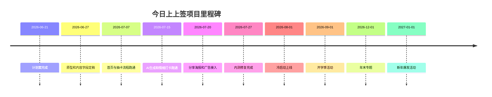

---


## 16. 开发任务拆分与协作规则

本项目从一开始就按“强解耦的并行开发”设计。整体功能要拆成多个互不覆盖的模块，每个模块都能基于 mock 数据独立开发、独立预览、独立检查，即使由不同 agent 分别处理，最后合并时也不应出现字段冲突、路径冲突或职责冲突。

### 16.1 模块边界

| 模块 | 输入 | 输出 | 不允许做的事 |
| --- | --- | --- | --- |
| 首页模块 | 今日卡摘要、用户状态 | 首页 UI 和主入口事件 | 直接调用 AI |
| 抽卡模块 | 抽卡状态、主题 | 抽卡动画和抽卡事件 | 修改卡片 JSON 字段 |
| 结果模块 | `DailyCard` | 完整结果页 | 改广告发放规则 |
| 分享模块 | `DailyCard`、小程序码 | 分享海报图片 | 重新生成卡片内容 |
| 内容模块 | 主题、情绪、历史摘要 | 卡片 JSON | 写前端页面逻辑 |
| 广告模块 | 广告位、用户状态 | 广告展示和完成事件 | 干扰首次核心体验 |
| 数据模块 | API 请求 | 数据读写和缓存 | 修改页面视觉 |
| 风控模块 | 文本、风险上下文 | 通过、拦截、兜底 | 输出营销承诺 |

### 16.2 流水线协作

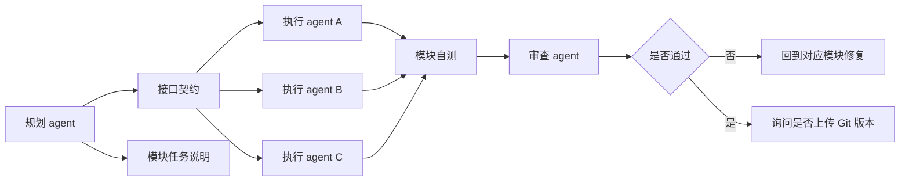

规划、执行与审查分离：

1. 规划阶段只定义目标、边界、接口、验收标准。
2. 执行阶段只实现被分配模块，不改其他模块内部逻辑。
3. 审查阶段检查接口一致性、体验、合规、性能和合并风险。
4. 审查通过后，先询问是否上传 Git 版本，再进入下一节点。

### 16.3 契约先行

并行开发前先冻结这些共享契约：

| 契约 | 示例 | 作用 |
| --- | --- | --- |
| 页面路径 | `/pages/index/index` | 避免页面冲突 |
| 组件输入输出 | `GuideCard(props)` | 避免组件互相改字段 |
| API 路径 | `/api/card/today` | 避免前后端对不上 |
| 数据模型 | `DailyCard` | 统一内容、结果页、分享图 |
| 埋点事件 | `card_draw_success` | 统一统计口径 |
| 广告位名称 | `result_reward_redraw` | 统一广告触发和权益发放 |
| 风控结果 | `normal / sensitive / blocked` | 统一兜底逻辑 |

### 16.4 合并规则

1. 页面模块不直接依赖 AI 服务，只消费后端返回或 mock 数据。
2. 内容模块不关心页面样式，只保证输出字段完整、合规。
3. 广告模块不决定主流程，只返回广告状态和权益发放结果。
4. 分享模块不重新组织业务逻辑，只把卡片数据转为海报。
5. 涉及字段、路径、事件名变更时，先更新文档，再改代码。
6. 每个 agent 只修改自己负责的目录和文档段落，跨模块改动要单独记录。

### 16.5 Git 版本节点

每个关键节点通过后，都要向项目负责人询问：

```text
当前节点已完成并通过检查，是否上传一个版本至 Git，方便后续回滚和对比？
```

| 节点 | 通过标准 | 是否询问 Git |
| --- | --- | --- |
| 项目骨架建立 | 文档、目录、模块拆分齐全 | 是 |
| 接口契约定稿 | API、数据字段、组件输入输出稳定 | 是 |
| 首页抽卡结果跑通 | mock 数据可完整展示 | 是 |
| 内容生成跑通 | 模板、AI 改写、兜底、安全过滤可用 | 是 |
| 分享海报跑通 | 结果页可生成海报 | 是 |
| 广告激励跑通 | 看视频后能解锁补充卡 | 是 |
| 内测修复完成 | 高优问题修复，核心路径稳定 | 是 |
| 提审前冻结 | 版本、声明、素材、配置确认 | 是 |

## 17. 六周开发任务拆分

### 17.1 第一周：产品和原型

| 任务 | 产出 |
| --- | --- |
| 明确 MVP 功能边界 | 功能清单 |
| 设计首页、抽卡、结果、情绪页 | 低保真原型 |
| 定义卡片 JSON 字段 | 数据结构 |
| 编写 30 条样例卡片 | 内容样本 |
| 明确广告触发点 | 广告策略 |

### 17.2 第二周：小程序框架

| 任务 | 产出 |
| --- | --- |
| 创建小程序项目 | 基础工程 |
| 搭建首页和结果页 | 可点击页面 |
| 实现抽卡动画 | 基础交互 |
| 实现本地 mock 数据 | 可演示流程 |
| 建立样式规范 | 基础 UI |

### 17.3 第三周：后端和数据

| 任务 | 产出 |
| --- | --- |
| 用户初始化 | 匿名用户档案 |
| 今日卡片接口 | 卡片生成和缓存 |
| 情绪打卡接口 | 情绪记录 |
| 历史记录接口 | 历史页 |
| 埋点接口 | 基础数据 |

### 17.4 第四周：AI 和风控

| 任务 | 产出 |
| --- | --- |
| 接入 AI 服务 | 生成今日卡 |
| 加入模板库 | 降低成本 |
| 加入安全规则 | 风控初版 |
| 答案之书 | 问答功能 |
| 异常兜底 | AI 失败时展示模板 |

### 17.5 第五周：分享和广告

| 任务 | 产出 |
| --- | --- |
| Canvas 分享图 | 海报生成 |
| 小程序码配置 | 分享闭环 |
| 激励视频接入 | 再抽功能 |
| Banner 接入 | 基础变现 |
| 广告事件埋点 | 变现数据 |

### 17.6 第六周：测试和上线

| 任务 | 产出 |
| --- | --- |
| 30-50 人内测 | 反馈表 |
| 修复核心问题 | 稳定版本 |
| 准备审核材料 | 提审包 |
| 准备冷启动内容 | 10-20 条种草素材 |
| 上线监控 | 数据看板 |

---

## 18. 上线清单

### 18.1 产品清单

- [ ] 首次进入流程不超过 2 个问题。
- [ ] 用户无需登录即可获得第一张指引卡。
- [ ] 今日上上签卡字段完整。
- [ ] 情绪打卡可提交。
- [ ] 历史记录可查看。
- [ ] 答案之书有安全兜底。
- [ ] 分享海报可生成。
- [ ] 免责声明清晰可见。

### 18.2 技术清单

- [ ] AI Key 不暴露在前端。
- [ ] 今日卡片有缓存。
- [ ] AI 失败时使用兜底模板。
- [ ] 敏感内容能拦截。
- [ ] 关键接口有错误处理。
- [ ] 数据库权限配置正确。
- [ ] 埋点能记录核心事件。
- [ ] 广告完成后权益能正确发放。

### 18.3 运营清单

- [ ] 至少 30 天内容模板。
- [ ] 至少 10 张分享海报样例。
- [ ] 至少 10 条小红书/抖音预热文案。
- [ ] 3 个用户反馈渠道。
- [ ] 每日数据复盘表。
- [ ] 开学季主题内容包。
- [ ] 年末主题内容包。

---

## 19. 最小可行版本建议

如果只用最少时间做第一版，建议只做这 5 个功能：

1. 今日抽卡：用户打开即可抽一张今日上上签。
2. 今日宜忌：每张卡有一个宜、一个忌。
3. 微行动：给用户一个 3 分钟内可做的小任务。
4. 分享海报：生成适合传播的卡片图。
5. 激励视频再抽：看广告解锁补充卡。

情绪打卡和答案之书可以作为第 2 个小版本加入。这样第一版更快上线，先验证“指引卡是否能被分享、广告是否能被接受”。

---

## 20. 最推荐的第一版页面顺序

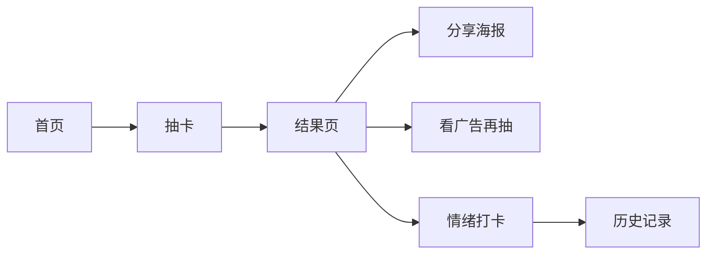

第一版的核心不是功能多，而是结果页的卡片文案和分享图足够打动人。

---

## 21. 下一步行动建议

### 21.1 立即要做的 3 件事

1. 定稿 MVP：只做今日卡、宜忌、微行动、分享、广告再抽。
2. 做 30 条高质量样例卡：先人工写好，确认产品气质。
3. 出首页和结果页原型：确认视觉风格和用户路径。

### 21.2 样例今日上上签卡

```json
{
  "theme": "事业",
  "card_name": "稳住牌",
  "keyword": "稳住",
  "opening": "今天不适合用力过猛，你真正需要的是把注意力收回来。",
  "advice": "先完成一个可以交付的小动作，而不是继续想象整个结果。",
  "do": "把今天最大的事拆成一个 10 分钟任务",
  "avoid": "反复比较别人的速度",
  "micro_action": "打开备忘录，写下今天最小的一步，并在 10 分钟内完成它。",
  "reflection": "你焦虑的不是慢，而是不确定自己有没有在前进。",
  "share_text": "今天的关键词是稳住：先完成一小步，再评价自己。",
  "risk_level": "normal"
}
```

### 21.3 判断项目是否值得继续的早期信号

| 信号 | 说明 |
| --- | --- |
| 分享率高 | 用户愿意把卡片发出去，说明内容有传播价值 |
| D1 留存还可以 | 用户第二天愿意回来，说明每日机制成立 |
| 激励视频完成率不低 | 广告触发点自然，商业化有希望 |
| 用户主动反馈“像在说我” | 个性化感知成立 |
| 小红书评论有人求入口 | 外部内容种草成立 |

如果早期分享率低，优先优化文案和海报，不急着加功能。

## 22. 第二版财运风 v2 增强层方案

第二版财运风已作为当前主要视觉方向。v2 增强层用于提升留存、分享和轻变现，不替代原本的每日心理仪式感主流程。

主流程保持不变：

```text
每日抽卡 → 今日建议 → 微行动 → 分享 / 记录
```

增强层只在主流程之后出现。用户每天第一次打开产品时，仍然应先获得“今天该怎么过”的指引，而不是先看到稀有度、排名、广告或收集任务。

### 22.1 功能补充

| 模块 | 设计 | 对留存 / 盈利的作用 | 边界 |
| --- | --- | --- | --- |
| 稀有好运牌特效 | SSR、福运、大吉等高稀有牌使用跳动火焰、金色光环、烫金扫光和特殊翻牌动画 | 强化抽卡期待，提升次日回访 | 普通牌不使用同等级特效，避免稀有感失效 |
| 验证成功后的感谢入口 | 用户主动确认“今天真的有点准”后，出现“添一束好运火”等轻量支持入口 | 形成隐晦收益场景 | 负面情绪、低运牌、未验证成功时不出现 |
| 好友比手气 | 分享卡片并与好友比较今日手气、稀有度和好运值 | 增强分享、拉新和回访 | 不做金钱输赢，不做羞辱性排名 |
| 群体好运火种池 | 多位好友的好运聚在一起，生成一句群体鼓励 | 适合微信群传播，提高群体打开率 | 只输出正向鼓励，不绑定现实财富承诺 |
| 牌册与稀有度 | 展示以往抽到的牌，按稀有度和牌组组织 | 提升长期收集动机 | 套装解读只能是阶段性自我观察 |
| 广告转运 | 低运牌通过激励视频获得更温和、更可行动的转机卡 | 增加激励视频触发点 | 表达为“换个角度”，不能暗示广告真实改变运气 |
| 负面牌消解 | 用户输入“我已克服 / 我已解决”后，负面牌合并消失，只留下行动记录 | 降低负面体验，提升情绪安全感 | 不把负面牌做成稀有收藏 |

### 22.2 稀有牌视觉规则

稀有牌需要和普通牌形成明显视觉差异，让用户感到“抽中了一张值得保存的卡”。

| 稀有度 | 视觉表现 | 使用场景 |
| --- | --- | --- |
| 普通 | 基础金纸卡、轻微光泽 | 日常指引 |
| 稀有 | 卡边微光、轻扫光、较强印章 | 状态较好或分享卡 |
| 超稀有 | 跳动火焰、金色光环、烫金扫光、特殊翻牌 | 大吉、福运、财气、节日主题 |
| 负面 | 降低收藏感，使用暗色和可消解动效 | 情绪承接、行动提醒 |

稀有动效不应阻挡用户阅读内容。动画结束后，卡片仍要清晰呈现今日建议、宜忌和微行动。

### 22.3 轻变现规则

感谢入口不是强付费，也不能包装成“改命、消灾、必转运”。它只在以下条件同时满足时出现：

1. 用户主动点击“今天真的有点准”或类似验证按钮。
2. 当日情绪状态不是焦虑、崩溃、极度疲惫等低状态。
3. 当日卡片不是负面牌或低运牌。
4. 页面已经先给出完整指引和微行动。

推荐文案方向：

```text
如果这张签今天真的帮你留住了一点好运，可以轻轻添一束好运火。
```

禁止文案方向：

```text
付费后转运
添火后财运更旺
不支持会错过好运
```

### 22.4 分享与群体激励

分享重点从“晒运势”转成“比比今日手气”。这能让分享更轻松，也降低用户对玄学判断的压力。

好友比较建议展示：

1. 今日卡名。
2. 稀有度。
3. 今日好运值。
4. 一句卡片短句。

群体好运火种池建议展示：

1. 参与好友数量。
2. 今日群体关键词。
3. 一句群体鼓励。
4. 继续邀请好友抽签的入口。

群体激励只能表达“大家一起往前走”，不能表达“谁拖后腿”或“谁今天运气差”。

### 22.5 牌册与套装解读

牌册用于长期留存。用户可以看到自己抽到过的牌、稀有度、所属牌组和缺失卡片。

套装解读的边界：

| 可以输出 | 不应输出 |
| --- | --- |
| 最近状态观察 | 命运结论 |
| 行动倾向总结 | 财运承诺 |
| 情绪变化提醒 | 感情结果判断 |
| 下一阶段建议 | 医疗、投资或重大人生决策 |

示例：

```text
你最近抽到的牌多集中在“稳住、回神、转机”，说明这一阶段更适合减小动作半径，把已经开始的事做完。
```

### 22.6 转运与负面牌消解

低运牌可以通过激励视频获得“转机卡”，但文案必须表达为“换个角度看今天”，不能表达成现实运气被改变。

负面牌不进入稀有收藏体系。用户可以输入：

```text
我已克服
我已解决
我已放下
```

输入后，负面牌以合并、淡出、化成光点等方式消失，只留下行动记录。这个设计用于结束焦虑循环，而不是强化负面体验。

### 22.7 模块解耦要求

v2 增强层必须保持模块独立：

| 模块 | 输入 | 输出 | 不允许做的事 |
| --- | --- | --- | --- |
| 稀有牌特效模块 | 卡片稀有度、卡片类型 | 动效状态和样式 class | 修改卡片内容 |
| 感谢入口模块 | 验证状态、情绪状态、卡片类型 | 是否展示入口 | 绕过情绪和卡片判断 |
| 好友比手气模块 | 好友卡片摘要 | 排行和分享图数据 | 输出羞辱性排名 |
| 群体好运模块 | 多人卡片摘要 | 群体关键词和鼓励语 | 绑定真实财富承诺 |
| 牌册模块 | 历史卡片、牌组配置 | 牌册、稀有度、套装进度 | 输出命运结论 |
| 广告转运模块 | 低运牌、广告完成状态 | 转机卡 | 暗示广告改变现实运气 |
| 负面牌消解模块 | 负面牌、完成语 | 消解状态和行动记录 | 把负面牌加入稀有收藏 |


